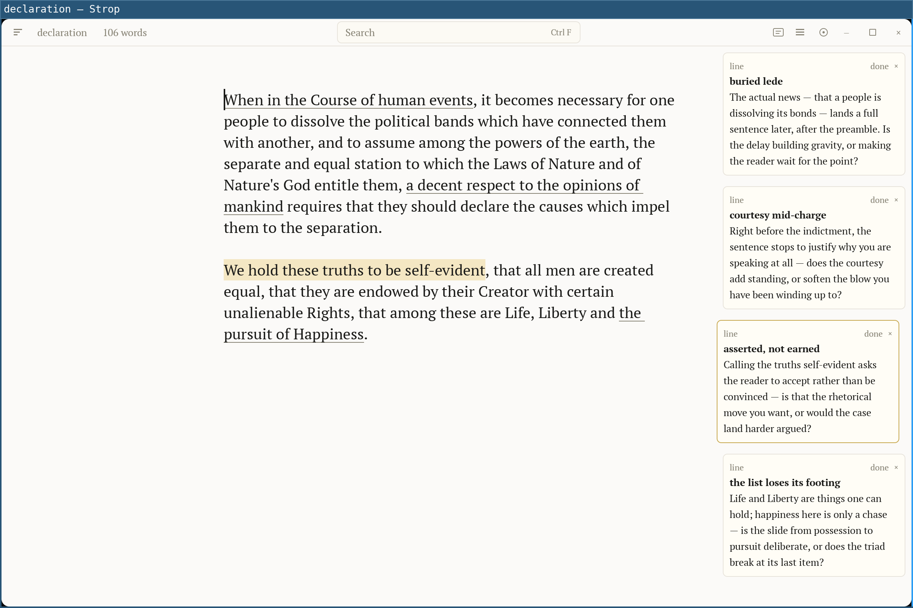

# Strop

> **strop** — a strip of leather you rub a razor on to make the blade sharp.
> 
> **strop** *(UK informal)* — a bad mood, especially one in which a person will not do as they are asked.
> 
> — [Cambridge Dictionary](https://dictionary.cambridge.org/dictionary/english/strop)

**In the human–AI centaur, don't be the horse.**

  

In the *advanced chess* Garry Kasparov championed, a human paired with a machine
beats both the best grandmaster and the best engine — as long as the human stays
in charge of the ideas. Most AI writing tools invert that: the machine drafts, you
approve, and your voice dissolves into a language model's median style.

Strop keeps you in charge. You write every sentence. The machine is the editor in
the margin — it reads your draft the way a sharp editor would, names what isn't
working as a question, and never rewrites a line.

## What it does

- **An editor that diagnoses, never prescribes.** An explicit command (or a shortcut pressed) runs an editorial pass at a depth you choose — developmental, line, or copy. It returns named problems as questions in the margin ("Is this the real beginning?"), never replacement text. Dismiss one and it stays gone.
- **Your voice, not the model's.** Bring your own LLM — any OpenAI-compatible API, including a local Ollama. A pass only ever sends text to the provider you pick; point it at a local model and nothing leaves your machine.
- **A calm canvas.** Typing-first, with typography handled as you write — language-aware quotes, em dashes, the right non-breaking spaces — and any substitution it makes is undone with a single keystroke.
- **History you own.** `.strop` files are auto-saving and always carry the whole editing history. Don't lose Undo after restarts, save named snapshots for future reference, easily compare between revisions.
- **Plain, portable files.** One `.strop` file per document; Markdown in and out.

## Where it's at

Strop is early, and built in the open. **[v0.1.0](https://github.com/kirushik/strop/releases/latest)** is the first rough cut — see the [changelog](CHANGELOG.md). Only **Linux (Wayland)** is runtime-tested; the macOS and Windows binaries build and pass a headless launch smoke but are otherwise unverified and unsigned. Building from source is the supported path: see **[DEVELOPMENT.md](DEVELOPMENT.md)**.

## License

[GPL-3.0-or-later](COPYING). Built on Zed's
[gpui](https://github.com/zed-industries/zed); bundled PT fonts are © ParaType
under the SIL Open Font License. Attribution in [NOTICE](NOTICE).
